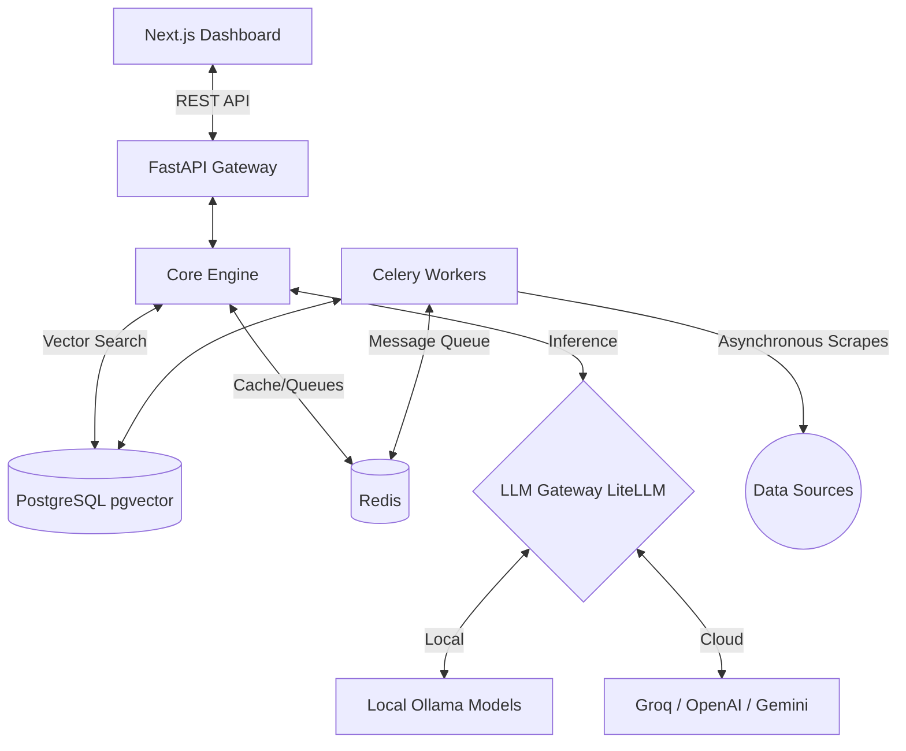

<p align="center">
  
</p>

# MarketMind

MarketMind is an AI-driven market intelligence and competitive analysis system designed to help users aggregate, analyze, and gain insights from various market sources. By utilizing powerful language models and vector search capabilities, it streamlines the complex process of extracting competitive intel and producing comprehensive reports.

[](LICENSE)
[](pyproject.toml)
[](interface/dashboard/package.json)
[](docker-compose.yml)
[](https://deepwiki.com/fahimulhaque/MarketMind)

## 🌟 Key Features

- **Local-First Privacy**: Run fully locally using Ollama (`qwen` models), ensuring no sensitive proprietary queries leak to third parties.
- **Cloud Scale**: Hot-swap to cloud LLMs (Groq, OpenAI, Anthropic) via LiteLLM simply by changing your `.env` keys.
- **Asynchronous Ingestion**: Heavy scraping and data ingestion are offloaded to Celery background workers.
- **Semantic Memory**: Robust memory graphs and continuous vector ingestion powered by Postgres `pgvector`.
- **Beautiful Dashboard**: A Next.js responsive UI providing quick access to market insights.

## 🏗 Architecture Overview

MarketMind's containerized architecture strictly separates the ingestion layer, the brain (LLMs/Vector DB), and the user interface.



## 📋 Prerequisites

To run MarketMind locally, you must have the following installed on your host machine:
- [Docker Engine & Docker Compose](https://docs.docker.com/get-docker/) (Docker Desktop recommended for Mac/Windows)

*Note: If you plan to contribute to the codebase without using the Docker environment, you will also need Python 3.10+ and Node.js 18.17+.*

---

## 🚀 Getting Started

The easiest way to get MarketMind running is by using our bundled `./marketmind` orchestration script which handles environment setup, dependencies, and Docker orchestration for you.

### 1. Clone the repository
```bash
git clone https://github.com/your-org/MarketMind.git
cd MarketMind
```

### 2. Configure Environment Variables
Copy the example environment file. You can leave the defaults if you just want to run local models!
```bash
cp .env.example .env
```
*(See Configuration details below if you want to use Cloud LLMs or add external API Keys).*

### 3. Start the Infrastructure
```bash
./marketmind start
```
> **Note:** The initial startup will download several Docker images including the default local LLM models (`qwen2.5:1.5b` and `nomic-embed-text` via Ollama). This may take several minutes depending on your internet connection.

### 4. Access the App
Once the services map port statuses:
- **Dashboard UI**: [http://localhost:3000](http://localhost:3000)
- **FastAPI Backend Docs**: [http://localhost:8000/docs](http://localhost:8000/docs)

---

## ⚙️ Configuration (.env)

MarketMind is incredibly configurable. While the defaults work out of the box using local Docker services, you can unlock much faster inference and better data by adding your keys.

### Local vs Cloud LLMs
By default, MarketMind uses local **Ollama** models. 
To switch to a cloud provider natively (e.g. Groq):
1. Open `.env`
2. Set `LLM_PROVIDER=groq`
3. Set `LLM_API_KEY=gsk_your_groq_api_key_here...`

*(MarketMind supports `openai`, `anthropic`, `gemini`, `together`, and `groq` through its LiteLLM integration router).*

### External Data Providers
To enrich your market reports, you can add API keys for major financial data providers in your `.env` file:
```ini
# Add your registered API Keys here
FRED_API_KEY=your_key_here
ALPHA_VANTAGE_API_KEY=your_key_here
FMP_API_KEY=your_key_here

# Social Data (Reddit requires no keys, but uses this UA)
SEC_EDGAR_USER_AGENT="MarketMind admin@yourdomain.com"
```

---

## 🛠 Useful CLI Commands

Instead of memorizing long `docker compose` strings, you can use the bundled `./marketmind` CLI for granular stack control:

| Command | Action |
| --- | --- |
| `./marketmind start` | Boot up the entire architecture in the background. |
| `./marketmind status` | View the health and running status of all containers. |
| `./marketmind help` | Learn about all available commands. |
| `./marketmind logs [service]` | Stream colored logs. (e.g. `./marketmind logs api`) |
| `./marketmind restart [service]` | Bounce a specific container. (e.g. `./marketmind restart worker`) |
| `./marketmind refresh [service]` | Force a rebuild of a container after adding new Py/Node packages! |
| `./marketmind shell <service>` | Drop into an interactive bash prompt inside a running container. |
| `./marketmind stop` | Gracefully pause services without losing data. |
| `./marketmind clean` | **Destructive!** Tears down all networks, containers, and destroys Postgres/Ollama local volumes. |


## 🤝 Contributing
We welcome contributions! Please review our [Contributing Guidelines](CONTRIBUTING.md) to understand our development workflow, coding standards, and how to submit pull requests.

## 🛡 Security & Code of Conduct
- [Contributor Code of Conduct](CODE_OF_CONDUCT.md)
- [Security Policy](SECURITY.md) 

## 📝 License
This project is licensed under the [MIT License](LICENSE).
